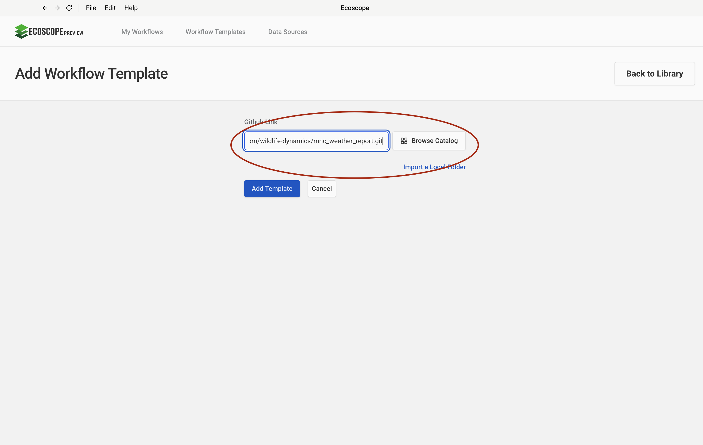

# MNC Patrol Effort — User Guide

This guide walks you through configuring and running the MNC Patrol Effort workflow, which processes patrol events and observations from EarthRanger to produce trajectory maps, patrol effort summaries, and a patrol coverage analysis for Mara North Conservancy.

---

## Overview

The workflow delivers, for each run:

- **Events summary** — total events recorded by date and by type, with a line chart
- **Patrol purpose summary** — patrol count and distance grouped by patrol purpose
- **Patrol relocations** — full observation dataset as a GeoParquet file
- **Foot patrol report** — effort summary table (CSV), trajectory GeoJSON, and map (HTML + PNG)
- **Vehicle patrol report** — effort summary table (CSV), trajectory GeoJSON, and map (HTML + PNG)
- **Motorbike patrol report** — effort summary table (CSV), trajectory GeoJSON, and map (HTML + PNG)
- **Combined trajectories** — merged trajectory dataset (GeoParquet)
- **Overall patrol efforts** — per-ranger summary of patrols, distance, and duration (CSV)
- **Patrol coverage map** — 1 000 m grid-cell visit density map (HTML + PNG) with occupancy percentage

---

## Prerequisites

Before running the workflow, ensure you have:

- Access to an **EarthRanger** instance with `patrol_info` events and associated patrol observations recorded for the analysis period

---

## Step-by-Step Configuration

### Step 1 — Add the Workflow Template

In the workflow runner, go to **Workflow Templates** and click **Add Workflow Template**. Paste the GitHub repository URL into the **Github Link** field:

```
https://github.com/wildlife-dynamics/mnc_patrol_effort.git
```

Then click **Add Template**.



---

### Step 2 — Configure the EarthRanger Connection

Navigate to **Data Sources** and click **Connect**, then select **EarthRanger**. Fill in the connection form:

| Field | Description |
|-------|-------------|
| Data Source Name | A label to identify this connection (e.g. `Mara North Conservancy`) |
| EarthRanger URL | Your instance URL (e.g. `your-site.pamdas.org`) |
| EarthRanger Username | Your EarthRanger username |
| EarthRanger Password | Your EarthRanger password |

> Credentials are not validated at setup time. Any authentication errors will appear when the workflow runs.

Click **Connect** to save.


---

### Step 3 — Select the Workflow

After the template is added, it appears in the **Workflow Templates** list as **mnc_patrol_effort**. Click the card to open the workflow configuration form.


---

### Step 4 — Configure Workflow Details, Time Range, and EarthRanger Connection

The configuration form has three sections on a single page.

**Set workflow details**

| Field | Description |
|-------|-------------|
| Workflow Name | A short name to identify this run |
| Workflow Description | Optional notes (e.g. reporting month or site) |

**Time range**

| Field | Description |
|-------|-------------|
| Timezone | Select the local timezone (e.g. `Africa/Nairobi UTC+03:00`) |
| Since | Start date and time — all events and patrol data from this point are fetched |
| Until | End date and time of the analysis window |

**Connect to ER**

Select the EarthRanger data source configured in Step 2 from the **Data Source** dropdown (e.g. `Mara North Conservancy`).

Once all three sections are filled, click **Submit**.


---

## Running the Workflow

Once submitted, the runner will:

1. Download the MNC community conservancy boundary and parcels GeoPackage files from Dropbox; load, split by grazing zone, and build styled DeckGL layers (conservancy boundaries, parcels, grazing zone fills, text labels).
2. Fetch all events from EarthRanger; extract the date from each timestamp; add a temporal index; exclude `distancecountwildlife_rep`, `distancecountpatrol_rep`, `airstrip_operations`, and `silence_source_rep` events; summarise by date and by type; draw a daily events line chart; save as `total_events_recorded_by_date.csv`, `total_events_recorded_by_type.csv`, and `total_events_recorded.html`/`.png`.
3. Filter `patrol_info` events; flatten event details; rename fields (`purpose`, `transport_type`, `participants`, `patrol_id`); summarise by patrol purpose; capitalise text; add totals row; save as `patrol_purpose_summary.csv`.
4. Map ranger participant names; filter records with non-empty patrol IDs; replace missing transport type with `unspecified`; explode `patrol_id` and `participants` columns; fetch patrol values from EarthRanger; fetch patrol observations (including patrol details); merge with patrol info; process relocations (filtering sentinel coordinates); save as `patrol_relocations.geoparquet`.
5. Split relocations into three transport-type branches — **foot**, **vehicle**, and **motorbike** — and convert each to trajectories using type-appropriate segment filters.
6. For each patrol type: rename trajectory columns; summarise effort metrics (patrols, distance km, duration hrs, average speed) by `patrol_type_value`; add totals row; save effort CSV; apply `tab20` colormap; strip non-essential columns (geometry, color, `patrol_type_value`); persist as GeoJSON; generate map layers; combine with conservancy boundary layers; draw map; rewrite file URLs for screenshot rendering; save map as HTML and PNG.
7. Merge foot, vehicle, and motorbike trajectories; rename combined columns; save as `patrol_trajectories.geoparquet`; summarise per-ranger effort (patrols, distance, duration); replace null participant names with `Unspecified`; add totals row; save as `overall_patrol_efforts.csv`.
8. Compute a 1 000 m patrol coverage grid; apply equal-interval classification (5 bins) and `RdYlGn_r` colormap; draw coverage map; save as `patrol_coverage_map.html`/`.png`; compute occupancy percentage against the conservancy boundary; round to 2 decimal places; save as `patrol_coverage.csv`.
9. Save all outputs to the directory specified by `ECOSCOPE_WORKFLOWS_RESULTS`.

---

## Output Files

All outputs are written to `$ECOSCOPE_WORKFLOWS_RESULTS/`.

### Events Summary

| File | Description |
|------|-------------|
| `total_events_recorded_by_date.csv` | Daily event counts (all types combined) |
| `total_events_recorded_by_type.csv` | Daily event counts broken down by event type |
| `total_events_recorded.html` / `.png` | Line chart of daily event counts |

### Patrol Purpose

| File | Description |
|------|-------------|
| `patrol_purpose_summary.csv` | Patrol count and total distance by patrol purpose |

### Relocations

| File | Description |
|------|-------------|
| `patrol_relocations.geoparquet` | Full patrol observation dataset with patrol metadata |

### Foot Patrols

| File | Description |
|------|-------------|
| `foot_patrol_efforts.csv` | Patrol count, distance, duration, and average speed by patrol type |
| `foot_patrol_trajectories.geojson` | Foot patrol trajectory geometries |
| `foot_patrols_map.html` / `.png` | Foot patrol trajectories map coloured by patrol type |

### Vehicle Patrols

| File | Description |
|------|-------------|
| `vehicle_patrol_efforts.csv` | Patrol count, distance, duration, and average speed by patrol type |
| `vehicle_patrol_trajectories.geojson` | Vehicle patrol trajectory geometries |
| `vehicle_patrols_map.html` / `.png` | Vehicle patrol trajectories map coloured by patrol type |

### Motorbike Patrols

| File | Description |
|------|-------------|
| `motorbike_patrol_efforts.csv` | Patrol count, distance, duration, and average speed by patrol type |
| `motor_patrol_trajectories.geojson` | Motorbike patrol trajectory geometries |
| `motorbike_patrols_map.html` / `.png` | Motorbike patrol trajectories map coloured by patrol type |

### Combined Trajectories and Overall Effort

| File | Description |
|------|-------------|
| `patrol_trajectories.geoparquet` | Merged foot, vehicle, and motorbike trajectory dataset |
| `overall_patrol_efforts.csv` | Per-ranger summary of total patrols, distance km, and duration hrs |

### Patrol Coverage

| File | Description |
|------|-------------|
| `patrol_coverage_map.html` / `.png` | 1 000 m grid-cell visit density map coloured by visit frequency |
| `patrol_coverage.csv` | Patrol occupancy percentage per conservancy region |
