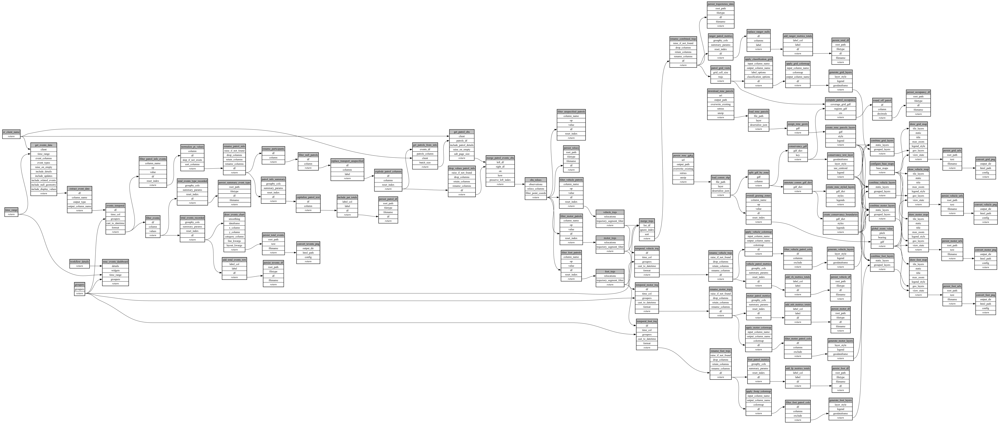

```
# AUTOGENERATED BY ECOSCOPE-WORKFLOWS; see fingerprint in README.md for details

```

```yaml
# fingerprint:
artifacts_sha256_basic: f6e7004d4d2c740875e873e17e5798a3e7eb00545a382e06347f70112e4d6620
artifacts_sha256_strict: 527316b9abecb37eae7810f9b848461158e27af011d84a99cc9e33c64b72fdec
installed_requirements:
- channel: https://repo.prefix.dev/ecoscope-workflows/
  name: ecoscope-workflows-core
  version: {version: ==0.22.18}
- channel: https://repo.prefix.dev/ecoscope-workflows/
  name: ecoscope-workflows-ext-ecoscope
  version: {version: ==0.22.18}
- channel: https://repo.prefix.dev/ecoscope-workflows-custom/
  name: ecoscope-workflows-ext-custom
  version: {version: ==0.0.39}
- channel: https://repo.prefix.dev/ecoscope-workflows-custom/
  name: ecoscope-workflows-ext-ste
  version: {version: ==0.0.13}
- channel: https://repo.prefix.dev/ecoscope-workflows-custom/
  name: ecoscope-workflows-ext-mnc
  version: {version: ==0.0.8}
params_sha256: 3ab4c0f59c459fe3feea277da14ef6a8b3d0dfc0f958f3f015ddd4d700bcc5f8
spec_sha256: 57ba240d7eb4c3c62282ecd21a58e884c9751ee3bb5d35ee817e9bddb29a679a

```

# ecoscope-workflows-mnc-patrol-effort-workflow


